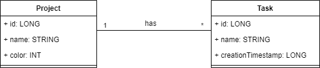
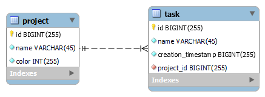
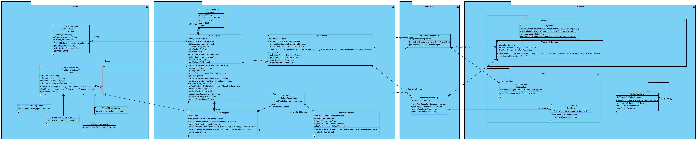

# Android data persistence

## Description

This is a project to demonstrate data persistence implementation in Android app.

I used it, when I teach Android in engineering schools.

## UML Use case diagram

You can create it with [draw.io](https://app.diagrams.net/) from scratch or import it from [here](./documentation/usecase.drawio).

[PDF Version](./documentation/usecase.pdf)

## Model entities

### UML logical data model

You can create it with [draw.io](https://app.diagrams.net/) from scratch or import it from [here](./documentation/logical.drawio).

[PDF Version](./documentation/logical.pdf)

### Physical data model

You can create it with [mysql workbench](https://dev.mysql.com/downloads/workbench/) from scratch or import it from [here](./documentation/physical.mwb).

[PDF Version](./documentation/physical.pdf)

## UML Class diagram

You can create it with [Visual Paradigm Entreprise](https://www.visual-paradigm.com/editions/enterprise/) from scratch or import it from [here](./documentation/todoc.vpp) or [here](./todoc.vpdm/Class%20Diagram1.vpd).

[PDF Version](./documentation/class.pdf)