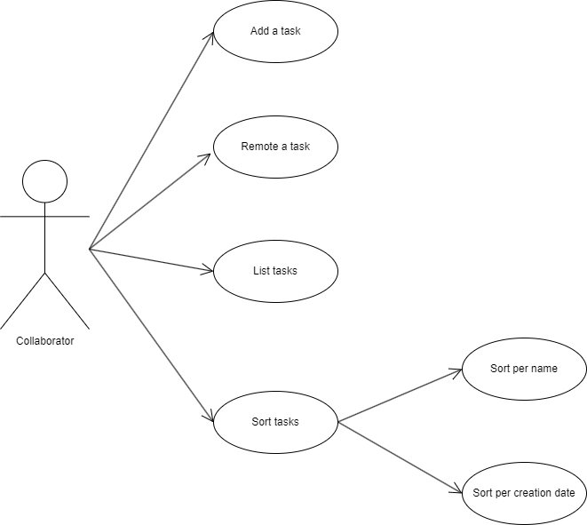

# Android data persistence

## Description

This is a project to demonstrate data persistence implementation in Android app.

I used it, when I teach Android in engineering schools.

## Use case diagram

You can create it with [draw.io](https://app.diagrams.net/) from scratch or import it from [here](./documentation/usecase.drawio).

